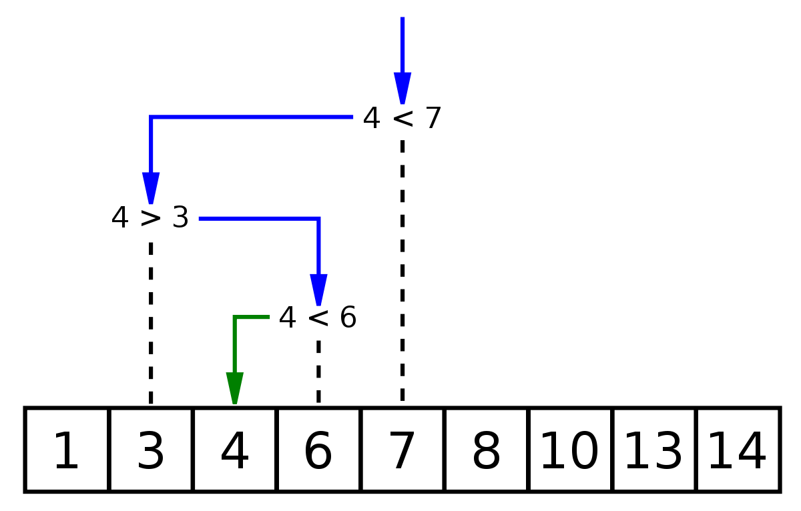
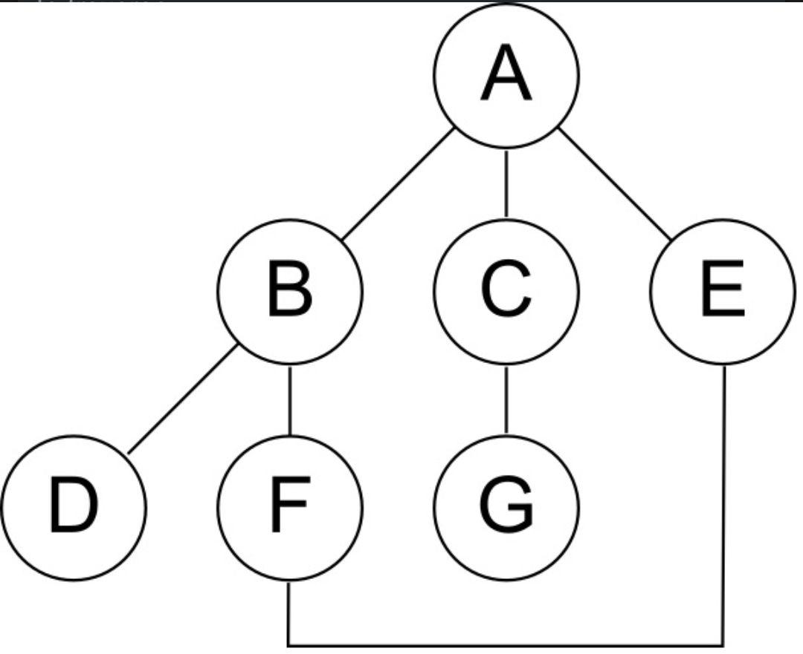

# Algoritmi di Ordinamento e di Ricerca

Tutti gli algoritmi di ordinamento condividono l’obiettivo di generare un array ordinato, ma il modo in cui ciascun algoritmo svolge questa attività può variare.
Quando si lavora con qualsiasi tipo di algoritmo, è importante sapere quanto è veloce e in quanto spazio opera.
Questi fattori sono indicati come **Time Complexity** e **Space Complexity** dell’algoritmo.

Questi sono alcuni algoritmi di ordinamento noti:

* Bubble Sort
* Selection Sort
* Insertion Sort
* Merge Sort
* QuickSort

Quando si sceglie un algoritmo di ordinamento, è necessario considerare la quantità di dati che si sta ordinando e il tempo necessario per implementare l’algoritmo.
Ad esempio, QuickSort è molto efficiente, ma può essere piuttosto complicato da implementare, mentre, Bubble Sort è semplice da implementare, ma è lento.

Per ordinare piccoli set di dati, Bubble Sort potrebbe essere un’opzione migliore poiché può essere implementato rapidamente, ma per set di dati più grandi, la velocità di QuickSort potrebbe valere la pena di implementare l’algoritmo seppur complesso.

***Prima di buttarsi sull’algoritmo che preferiamo o che conosciamo meglio vale la pena valutare tutti gli algoritmi per determinare la soluzione migliore.***

## Bubble Sort

Il Bubble Sort è un algoritmo utilizzato per ordinare una lista di elementi, ad esempio elementi in un array.
L’algoritmo confronta due elementi adiacenti e quindi li scambia se non sono in ordine.
Il processo viene ripetuto fino a quando non è più necessario lo scambio.

Per esempio, consideriamo il seguente array [3,1,5,2]:

1) [1,3,5,2], i primi due elementi vengono confrontati e scambiati.
2) [1,3,5,2], la coppia successiva viene confrontata e non scambiata, poiché sono in ordine.
3) [1,3,2,5], gli ultimi due elementi vengono scambiati.

Questa è stata la prima iterazione sull’array.

La seconda iterazione, invece, genera questi risultati:

1) [1,3,2,5]
2) [1,2,3,5]
3) [1,2,3,5]

La terza iterazione non cambierà alcun elemento, il che significa che l’elenco è ordinato!

**Il vantaggio principale di Bubble Sort è la semplicità dell’algoritmo.
In termini di complessità, Bubble Sort è considerato non ottimale, poiché ha richiesto più iterazioni sull’array.**

Nel peggiore dei casi, in cui tutti gli elementi devono essere scambiati, l'algoritmo richiederà:

scambi (n è il numero di elementi).

Implementazione: [C++](https://github.com/AntonioBerna/Algoritmi/blob/master/C%2B%2B/1_Bubble%20Sort/Bubble%20Sort.cpp), [Python](https://github.com/AntonioBerna/Algoritmi/blob/master/Python/1_Bubble%20Sort/Bubble%20Sort.py)

**Bonus: L’algoritmo si chiama Bubble Sort, perché ad ogni iterazione l’elemento più piccolo dell'array si sposta verso l’alto, proprio come una bolla sale sulla superficie dell'acqua.**

## Selection Sort

Il Selection Sort è un semplice algoritmo che trova l’elemento più piccolo nell’array e lo scambia con l’elemento nella prima posizione, quindi trova il secondo elemento più piccolo e lo scambia con l’elemento nella seconda posizione, e continua in questo modo fino a quando l’intero array è ordinato.

Per esempio, consideriamo il seguente array [3,1,5,2]:

1) L’elemento più piccolo è 1. Lo scambiamo con il primo elemento. Risultato: [1,3,5,2]
2) Il secondo più piccolo viene scambiato con il secondo elemento. Risultato: [1,2,5,3]
3) Il terzo più piccolo viene scambiato con il terzo elemento. Risultato: [1,2,3,5]

L’array è ordinato!

Implementazione: [C++](https://github.com/AntonioBerna/Algoritmi/blob/master/C%2B%2B/2_Selection%20Sort/Selection%20Sort.cpp), [Python](https://github.com/AntonioBerna/Algoritmi/blob/master/Python/2_Selection%20Sort/Selection%20Sort.py)

**Bonus: L'algoritmo è efficiente per gli array di piccole dimensioni, ma molto inefficiente per quelli di grandi dimensioni.**

## Insertion Sort

L'Insertion Sort è un semplice algoritmo che funziona nello stesso modo in cui vengono ordinate le carte da gioco nelle nostre mani. Ordiniamo le prime due carte e quindi posizioniamo la terza carta nella posizione appropriata all’interno delle prime due, quindi la quarta viene posizionata tra le prime tre e così via fino a quando l’intera mano non viene ordinata. Durante un’iterazione, un elemento dell'array viene inserito nella parte ordinata dell’array alla sua sinistra. Quindi, sostanzialmente, per ogni iterazione, abbiamo un array di elementi ordinati a sinistra e un array di elementi ancora da ordinare a destra.

Sembra confuso?

Diamo un’occhiata ad un esempio per capire meglio l’algoritmo. Consideriamo il seguente array [3,1,5,2]:

1) Iniziamo con il secondo elemento (1) e lo posizioniamo correttamente nell’array fra i primi due elementi. Risultato: [1,3,5,2], ora abbiamo un array ordinato a sinistra ([1,3]) e gli altri elementi ancora da ordinare a destra.
2) L’elemento successivo è 5. Inserendolo nell’array a sinistra si ottiene: [1,3,5,2].
3) L’ultimo elemento (2) viene inserito nella posizione corrispondente, risultando in: [1,2,3,5].

Ora l’array è ordinato!

Implementazione: [C++](https://github.com/AntonioBerna/Algoritmi/blob/master/C%2B%2B/3_Insertion%20Sort/Insertion%20Sort.cpp), [Python](https://github.com/AntonioBerna/Algoritmi/blob/master/Python/3_Insertion%20Sort/Insertion%20Sort.py)

**Bonus: L'algoritmo è efficiente per gli array di piccole dimensioni, ma molto inefficiente per quelli di grandi dimensioni.**

## Merge Sort

Il Merge Sort appartiene alla categoria degli algoritmi **Divide Et Impera**. Questi algoritmi funzionano suddividendo grossi problemi in più piccoli e più facilmente risolvibili. L’idea dell’algoritmo di tipo Merge è di dividere l’array a metà più e più volte fino a quando ogni singolo array è lungo solo un elemento. Quindi gli elementi vengono rimessi insieme (uniti) e ordinati.

Diamo un’occhiata ad un esempio, iniziamo dividendo l’array [31, 4, 88, 1, 4, 2, 42]:

1) Divido l’array in 2 parti: [31, 4, 88, 1] [4, 2, 42]
2) Divido l’array in 4 parti: [31, 4] [88, 1] [4, 2] [42]
3) Divido l’array in singoli elementi: [31] [4] [88] [1] [4] [2] [42]

Ora dobbiamo riunirli di nuovo insieme ordinandoli:

1) [4, 31] [1, 88] [2, 4] [42]
2) [1,4,31,88] [2,4,42]
3) [1,2,4,4,31,42,88].

Ora l’array è ordinato!

**L’idea alla base dell’algoritmo è che le parti più piccole sono più facili da ordinare e l'operazione di unione è la parte più importante dell’algoritmo.**

Implementazione: [C++](https://github.com/AntonioBerna/Algoritmi/blob/master/C%2B%2B/4_Merge%20Sort/Merge%20Sort.cpp), [Python](https://github.com/AntonioBerna/Algoritmi/blob/master/Python/4_Merge%20Sort/Merge%20Sort.py)

**Bonus: Il Merge Sort è utile per ordinare i Linked Lists (cioè una Struttura Dati), poiché le operazioni di unione possono essere implementate senza spazio aggiuntivo.**

## QuickSort

Anche il QuickSort appartiene alla categoria degli algoritmi **Divide Et Impera**, cioè, suddivide grossi problemi in più piccoli e più facilmente risolvibili. L’idea alla base del QuickSort è di scegliere un elemento perno (pivot). Le versioni di QuickSort si differenziano per il metodo di **pivot picking**. Il primo, l’ultimo, il mediano o anche un elemento selezionato casualmente è un possibile candidato da scegliere come perno. **La parte principale del processo di ordinamento è il partizionamento.**
Una volta scelto il perno, l’array viene suddiviso in due metà: una metà contenente tutti gli elementi più piccoli del perno e l’altra contenente tutti gli elementi più grandi del perno. Quindi, lo stesso processo si ripete in modo ricorsivo per le restanti metà dell'array, risultando infine in un array ordinato.

Consideriamo il seguente esempio [2, 0, 7, 4, 3]:

1) Scegliamo 3 (ultimo elemento in posizione 4) come perno.
2) Dopo aver fatto 4 confronti otteniamo le due metà dell'array più il perno: [2,0] (3) [7,4]
3) Ora, lo stesso processo si ripete per le due metà dell'array: scegliamo (0) come perno per il sotto l'array con gli elementi più piccoli e (4) per il sotto l'array con gli elementi più grandi.
4) Dopo un confronto per ogni metà, otteniamo: [(0)[2]] (3) [(4)[7]], che risulta essere un array ordinato!

Implementazione: [C++](https://github.com/AntonioBerna/Algoritmi/blob/master/C%2B%2B/5_QuickSort/QuickSort.cpp), [Python](https://github.com/AntonioBerna/Algoritmi/blob/master/Python/5_QuickSort/QuickSort.py)

### Vantaggi e Svantaggi del QuickSort

***La scelta del pivot (perno) fa una grande differenza, poiché una selezione del pivot non riuscita può ridurre significativamente la velocità dell’algoritmo. Una variante di QuickSort è il QuickSort a 3 vie, che lo rende più conveniente per i dati con elevata ridondanza. Invece, la versione casuale del QuickSort è la più efficiente: si sceglie il perno in modo casuale, evitando così i casi peggiori per modelli particolari (come array già ordinati), sebbene non del tutto.***

## Linear Search

La Ricerca Lineare è un algoritmo di ricerca molto semplice. Ogni elemento viene controllato e se viene trovata una corrispondenza, viene restituito quel particolare elemento, altrimenti la ricerca continua fino alla fine dell'elenco. La Ricerca Lineare non richiede un elenco ordinato.

Proviamo a cercare di trovare il valore x nell'elenco. L’algoritmo è formato dai seguenti passaggi:

1) Inizia dall'elemento più a sinistra dell'elenco e uno per uno confronta x con ciascun elemento dell'array.
2) Se x corrisponde a un elemento, restituisce l'indice.
3) Se x non corrisponde a nessuno degli elementi, restituisce -1.

Implementazione: [C++](https://github.com/AntonioBerna/Algoritmi/blob/master/C%2B%2B/6_Linear%20Search/LinearSearch.cpp), [Python](https://github.com/AntonioBerna/Algoritmi/blob/master/Python/6_Linear%20Search/LinearSearch.py)

**Bonus: La Ricerca Lineare viene raramente utilizzata perché altri algoritmi di ricerca, come l'algoritmo di Ricerca Binaria, consentono confronti di ricerca significativamente più veloci.**

## Binary Search

La Ricerca Binaria è un algoritmo di ricerca rapida che funziona su elenchi ordinati. Appartiene alla categoria **Divide Et Impera**, il che significa che scompone grossi problemi in problemi più piccoli e più facilmente risolvibili. L’algoritmo cerca una corrispondenza confrontando l’elemento centrale di un array. Se si verifica una corrispondenza, viene restituito l’indice dell’elemento. Se l’elemento centrale è maggiore dell’elemento da trovare, viene confrontato l’elemento centrale del sotto array a sinistra, altrimenti viene confrontato l’elemento centrale del sotto array a destra. Questo processo si ripete sui sotto array fino a quando la dimensione del sotto array non si riduce a zero. Fondamentalmente, l’array è diviso in due metà e la ricerca continua nella metà in cui l’elemento ha la possibilità di essere localizzato. Questo è il motivo per cui l’algoritmo richiede un elenco ordinato.

Prendiamo un array ordinato di esempio [2,5,16,18,24,42] e cerchiamo l’elemento 24:

1) Prendiamo l’elemento più centrale (18) e lo confrontiamo con 24. Avremmo potuto prendere anche un altro elemento centrale ma di solito si divide per 2 il numero di elementi nell’array e si prende come risultato l’indice dell’elemento centrale.
2) 18 < 24, quindi dividiamo l’array in due parti e continuiamo a lavorare con il sotto array a destra: [24, 42].
3) Lo stesso processo si ripete e visto che 42 > 24, consideriamo il sotto array sinistro: [24].

Elemento trovato!

Proviamo a cercare l’elemento 4 nell'array in figura, prendendo come elemento centrale 7:

Implementazione: [C++](https://github.com/AntonioBerna/Algoritmi/blob/master/C%2B%2B/7_Binary%20Search/BinarySearch.cpp), [Python](https://github.com/AntonioBerna/Algoritmi/blob/master/Python/7_Binary%20Search/BinarySearch.py)

**Bonus: Si chiama Ricerca Binaria perché divide continuamente l’array in due parti, con il risultato della parte sinistra o destra.**

## Depth-First Search (Ricerca Approfondita)

Questo algoritmo di ricerca è appositamente progettato per grafici (graphs) e alberi (trees). Un grafico è un insieme di nodi collegati. Ogni nodo è chiamato vertice (vertex) e la connessione tra due di essi è chiamata bordo (edge). Mentre un albero (trees) è un grafico aciclico cioè un grafico non orientato, in cui due vertici sono collegati esattamente da un percorso.

La Ricerca Approfondita (DFS) è un algoritmo di ricerca ricorsiva che utilizza il **backtracking**, cioè, inizia dalla radice dell’albero (nodo arbitrario nel caso del grafico) ed esplora il più possibile fino a quando tutti i nodi vengono visitati. **La parola backtrack significa che quando ci si sposta in avanti e non ci sono più nodi lungo il percorso, ci si sposta indietro sullo stesso percorso per trovare nodi da attraversare.**

Esempio: eseguiamo l’algoritmo sul grafico in basso e vediamo in quale ordine verranno visitati i nodi e inoltre supponiamo che l’algoritmo scelga i bordi a sinistra prima di quelli a destra:

1) Visitare il nodo A. Continuare sul nodo sinistro.
2) Visitare il nodo B. Continuare sul nodo sinistro.
3) Visitare il nodo D. Non ci sono più nodi disponibili nel percorso, torna al nodo B.
4) Visitare il nodo F. Continuare con il nodo disponibile nel percorso.
5) Visitare il nodo E. Il nodo A è già stato visitato.
6) Tornare al nodo A. Visitare il nodo C. Continuare con il nodo disponibile nel percorso.
7) Visitare il nodo G. Tutti i nodi sono stati visitati

Quindi, ricordando i nodi visitati l’ordine sarà: A, B, D, F, E, C, G.

Senza ricordare i nodi visitati: A, B, D, F, E (il percorso si ripeterà di nuovo) e non raggiugerà mai i nodi C e G.

Se rimuoviamo il bordo tra i nodi F ed E, otterremo un albero (trees) e l’ordine dei nodi visitati sarà: A, B, D, F, C, G, E.

Implementazione: [C++](https://github.com/AntonioBerna/Algoritmi/blob/master/C%2B%2B/8_Depth-First%20Search/Depth-Fisrt%20Search.cpp), [Python](https://github.com/AntonioBerna/Algoritmi/blob/master/Python/8_Depth-First%20Search/Depth-Fisrt%20Search.py)

**Bonus: Il DFS viene solitamente implementato utilizzando uno Stack (cioè una Struttura Dati) o un array / matrice di adiacenza.**

## Binary Search Tree

Binary Search Tree (BST) è un albero binario speciale in cui la chiave in ciascun nodo deve essere maggiore o uguale a qualsiasi chiave memorizzata nella sottostruttura sinistra e minore o uguale a qualsiasi chiave memorizzata nella sottostruttura destra.

Per esempio:

I BST consentono una rapida ricerca (aggiunta e rimozione di elementi) e possono essere utilizzati per implementare array dinamici o tabelle di ricerca che consentono di trovare un elemento tramite la sua chiave (ad esempio, trovare il numero di telefono di una persona con il cognome).

Le operazioni di ricerca, inserimento ed eliminazione sono fondamentali nei BST. Poiché le chiavi sono memorizzate in un ordine particolare, il principio della ricerca binaria può essere utilizzato per la ricerca. Partiamo dalla radice e confrontiamo la chiave. Se la radice ha la chiave, viene restituita come risultato. Se la chiave è maggiore della radice, la sottostruttura destra viene controllata in modo ricorsivo. Se la chiave è inferiore alla radice, la sottostruttura sinistra viene controllata in modo ricorsivo. La ricorsione continua fino a quando non viene trovata la chiave. Le operazioni di inserimento ed eliminazione sono molto simili, poiché entrambe utilizzano la stessa logica di ricerca per individuare il nodo necessario.

Implementazione: [C++](https://github.com/AntonioBerna/Algoritmi/blob/master/C%2B%2B/9_Binary%20Search%20Tree/Binary%20Search%20Tree.cpp), [Python](https://github.com/AntonioBerna/Algoritmi/blob/master/Python/9_Binary%20Search%20Tree/Binary%20Search%20Tree.py)

**Bonus: Gli Alberi di Ricerca Binaria sono utilizzati in molte applicazioni di ricerca.**

# Time Complexity

In Informatica, la complessità temporale misura o stima il tempo impiegato per l’esecuzione di un algoritmo e viene stimata contando il numero di operazioni elementari eseguite dall’algoritmo, supponendo che un’operazione elementare richieda una quantità fissa di tempo per essere eseguita. Poiché il tempo di esecuzione di un algoritmo può variare con input diversi della stessa dimensione, si considera comunemente la complessità temporale peggiore espressa usando la notazione Big-O, che è il tempo massimo impiegato sugli input di una data dimensione. Ad esempio, un algoritmo con complessità temporale 𝑂(n) è un algoritmo temporale lineare.

**È comune escludere costanti e coefficienti di ordine inferiore che non hanno un impatto così grande sulla complessità del problema. Ad esempio: 𝑂(2𝑛) e 𝑂(𝑛+5) sono uguali a 𝑂(n).**

## Complessità Temporali Comuni

𝑂(1) → 𝑇𝑒𝑚𝑝𝑜 𝐶𝑜𝑠𝑡𝑎𝑛𝑡𝑒: dato un input di dimensione n, è sufficiente un solo passaggio per eseguire l’algoritmo.

# Per maggiori informazioni

Mini Corso Base Algoritmi di Ordinamento [Youtube]: https://www.youtube.com/watch?v=KhsCEVO1zhk&t=23s

Created By Antonio Bernardini Copyright© 2020
