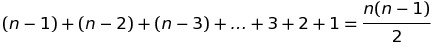

# Algoritmi di Ordinamento e di Ricerca

Tutti gli algoritmi di ordinamento condividono l’obiettivo di generare un elenco ordinato, ma il modo in cui ciascun algoritmo svolge questa attività può variare.
Quando si lavora con qualsiasi tipo di algoritmo, è importante sapere quanto è veloce e in quanto spazio opera.
Questi fattori sono indicati come Time Complexity e Space Complexity dell’algoritmo.

Ecco alcuni algoritmi di ordinamento noti:

* Bubble Sort
* Selection Sort
* Insertion Sort
* Merge Sort
* QuickSort

Quando si sceglie un algoritmo di ordinamento, è necessario considerare la quantità di dati che si sta ordinando e il tempo necessario per implementare l’algoritmo.
Ad esempio, QuickSort è molto efficiente, ma può essere piuttosto complicato da implementare, mentre, Bubble Sort è semplice da implementare, ma è lento.
Per ordinare piccoli set di dati, Bubble Sort potrebbe essere un’opzione migliore poiché può essere implementata rapidamente, ma per set di dati più grandi, la velocità di QuickSort potrebbe valere la pena di implementare l’algoritmo seppur complesso.

Prima di buttarsi sull’algoritmo che preferiamo o che conosciamo meglio vale la pena valutare tutti gli algoritmi per determinare la soluzione migliore.

## Bubble Sort

Bubble Sort è un algoritmo utilizzato per ordinare una lista di elementi, ad esempio elementi in un array.
L’algoritmo confronta due elementi adiacenti e quindi li scambia se non sono in ordine.
Il processo viene ripetuto fino a quando non è necessario più lo scambio.

Per esempio, consideriamo il seguente array [3,1,5,2]:

1) [1,3,5,2], i primi due elementi vengono confrontati e scambiati.
2) [1,3,5,2], la coppia successiva viene confrontata e non scambiata, poiché sono in ordine.
3) [1,3,2,5], gli ultimi due elementi vengono scambiati.

Questa è stata la prima iterazione sull’array.

Ora dobbiamo iniziare la seconda iterazione:

1) [1,3,2,5]
2) [1,2,3,5]
3) [1,2,3,5]

La terza iterazione non cambierà alcun elemento, il che significa che l’elenco è ordinato!

Il vantaggio principale di Bubble Sort è la semplicità dell’algoritmo.
In termini di complessità, Bubble Sort è considerato non ottimale, poiché ha richiesto più iterazioni sull’array.

Nel peggiore dei casi, in cui tutti gli elementi devono essere scambiati, richiederà:

scambi (n è il numero di elementi).

Implementazione: [C++](https://github.com/AntonioBerna/Algoritmi/blob/master/C%2B%2B/1_Bubble%20Sort/Bubble%20Sort.cpp), [Python](https://github.com/AntonioBerna/Algoritmi/blob/master/Python/1_Bubble%20Sort/Bubble%20Sort.py)

**Bonus: L’algoritmo si chiama Bubble Sort, perché ad ogni iterazione l’elemento più piccolo dell’elenco si sposta verso l’alto, proprio come una bolla sale sulla superficie dell'acqua.**

## Selection Sort

Selection Sort è un semplice algoritmo che trova l’elemento più piccolo nell’array e lo scambia con l’elemento nella prima posizione, quindi trova il secondo elemento più piccolo e lo scambia con l’elemento nella seconda posizione, e continua in questo modo fino a quando l’intero array è ordinato.

Per esempio, consideriamo il seguente array [3,1,5,2]:

1) L’elemento più piccolo è 1. Lo scambiamo con il primo elemento. Risultato: [1,3,5,2]
2) Il secondo più piccolo viene scambiato con il secondo elemento. Risultato: [1,2,5,3]
3) Il terzo più piccolo viene scambiato con il terzo elemento. Risultato: [1,2,3,5]

L’array è ordinato!

Implementazione: [C++](https://github.com/AntonioBerna/Algoritmi/blob/master/C%2B%2B/2_Selection%20Sort/Selection%20Sort.cpp), [Python](https://github.com/AntonioBerna/Algoritmi/blob/master/Python/2_Selection%20Sort/Selection%20Sort.py)

**Bonus: L'algoritmo è efficiente per gli array di piccole dimensioni, ma molto inefficiente per quelli di grandi dimensioni.**

## Insertion Sort

Insertion Sort è un semplice algoritmo che funziona nello stesso modo in cui vengono ordinate le carte da gioco nelle nostre mani. Ordiniamo le prime due carte e quindi posizioniamo la terza carta nella posizione appropriata all’interno delle prime due, quindi la quarta viene posizionata tra le prime tre e così via fino a quando l’intera mano non viene ordinata. Durante un’iterazione, un elemento dell’elenco viene inserito nella parte ordinata dell’array alla sua sinistra. Quindi, sostanzialmente, per ogni iterazione, abbiamo un array di elementi ordinati a sinistra e un array di elementi ancora da ordinare a destra.

Sembra confuso?

Diamo un’occhiata ad un esempio per capire meglio l’algoritmo. Consideriamo il seguente array [3,1,5,2]:

1) Iniziamo con il secondo elemento (1) e lo posizioniamo correttamente "nell’array" dei primi due elementi. Risultato: [1,3,5,2], ora abbiamo un array ordinato a sinistra ([1,3]) e gli altri elementi a destra.
2) L’elemento successivo è 5. Inserendolo nell’array a sinistra si ottiene: [1,3,5,2].
3) L’ultimo elemento (2) viene inserito nella posizione corrispondente, risultando in: [1,2,3,5].

Ora l’array è ordinato!

Implementazione: [C++](https://github.com/AntonioBerna/Algoritmi/blob/master/C%2B%2B/3_Insertion%20Sort/Insertion%20Sort.cpp), [Python](https://github.com/AntonioBerna/Algoritmi/blob/master/Python/3_Insertion%20Sort/Insertion%20Sort.py)

**Bonus: L'algoritmo è efficiente per gli array di piccole dimensioni, ma molto inefficiente per quelli di grandi dimensioni.**

## Merge Sort

# Per maggiori informazioni

Mini Corso Base Algoritmi di Ordinamento [Youtube]: https://www.youtube.com/watch?v=KhsCEVO1zhk&t=23s

Created By Antonio Bernardini Copyright© 2020
